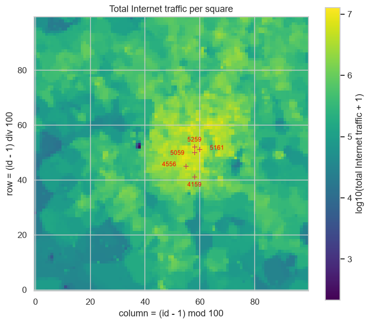
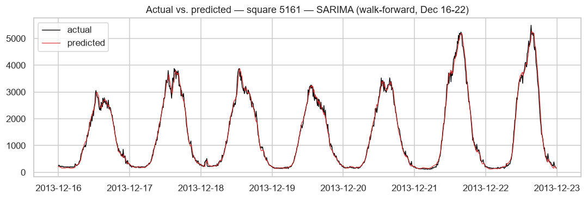
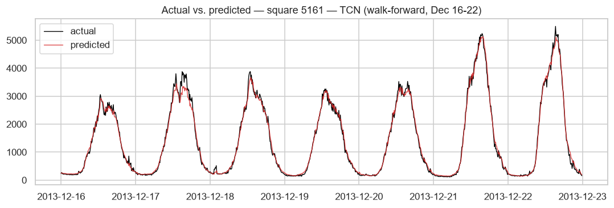
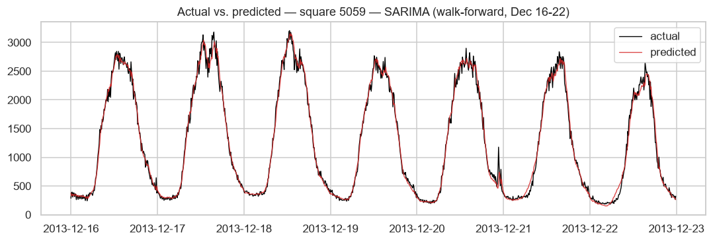
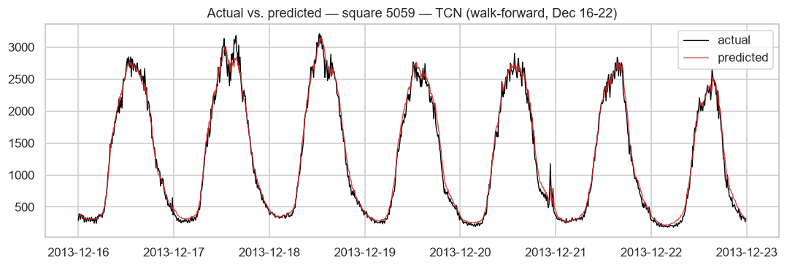
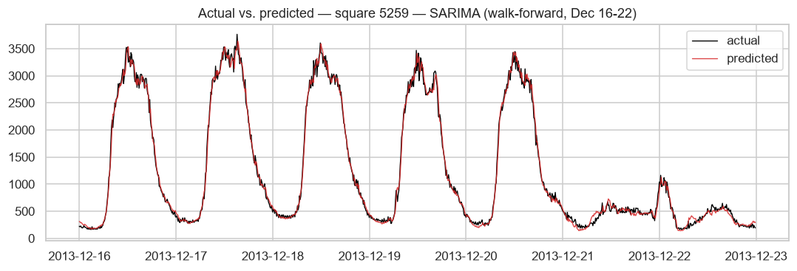
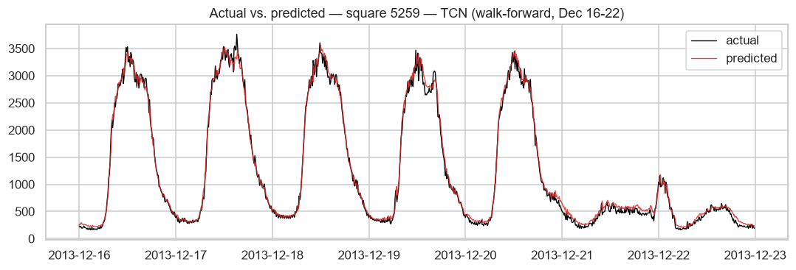
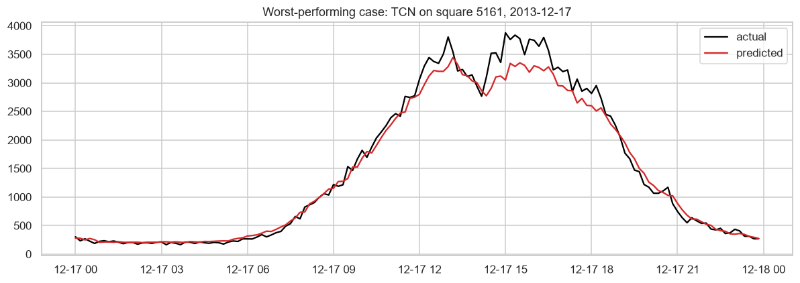

# Mobile Network Traffic Forecasting on the Milan CDR Grid

**One-step-ahead forecasting of Internet traffic for the week of December 16-22, 2013, on the Milan Telecom Italia CDR grid, with SARIMA, an LSTM and a TCN.**

Data: Telecom Italia CDR grid of Milan, Nov 1, 2013 - Jan 1, 2014, 10-minute intervals, 10,000 grid squares [1]. 
Evaluation: walk-forward one-step-ahead forecasts for Dec 16-22, 2013 on the three busiest squares.

# Introduction

Mobile network operators use short-term traffic forecasts for capacity planning and load balancing. This report looks at one-step-ahead forecasting of Internet traffic on the Milan Telecom Italia CDR grid [1] and asks: **how do different sequential models compare for one-step-ahead mobile traffic forecasting, and how does their performance vary across areas with different traffic characteristics?**

The data covers 10,000 grid squares of Milan at 10-minute resolution from Nov 1, 2013 to Jan 1, 2014. I forecast the Internet traffic of each of the three busiest squares over the week of Dec 16-22, 2013 with three models from different families: SARIMA (statistical), an LSTM (recurrent) and a TCN (convolutional) written from scratch. Every prediction uses only true past observations (walk-forward evaluation).

The report follows the two notebooks in the repository [6]. Related Work lists the literature used. Dataset and Data Preparation describes the memory-efficient loading. Exploratory Analysis looks at the traffic patterns of the squares in time and space. Methodology describes the models and how they were tuned. Results and Discussion gives the errors, the timings and one failure case. The Conclusion summarizes the findings and what could be done next.

# Related Work

The five sources below motivated the data used, the choice of models and the future work.

[1] G. Barlacchi, M. De Nadai, R. Larcher, et al., "A multi-source dataset of urban life in the city of Milan and the Province of Trentino," *Scientific Data*, vol. 2, no. 150055, 2015. Describes the Telecom Italia dataset used here (telecommunications, weather, news, social network and electricity data for Milan and Trentino).

[2] A. Azari, P. Papapetrou, S. Denic, and G. Peters, "Cellular Traffic Prediction and Classification: A Comparative Evaluation of LSTM and ARIMA," in *Proc. 22nd Int. Conf. Discovery Science (DS)*, Split, Croatia, 2019, pp. 129-144. Compares LSTM and ARIMA on cellular traffic. It finds LSTM better in general, especially with large and fine-grained training data, while ARIMA comes close in some cases at a much lower cost. This is why the project compares a classical model with a recurrent one instead of using only one of them.

[3] W. Wang, C. Zhou, H. He, W. Wu, W. Zhuang, and X. Shen, "Cellular Traffic Load Prediction with LSTM and Gaussian Process Regression," in *Proc. IEEE Int. Conf. Commun. (ICC)*, Dublin, Ireland, Jun. 2020, pp. 1-6. Combines an LSTM with Gaussian process regression to predict single-cell traffic on the Milan data, which supports using an LSTM for each square here.

[4] C. Zhang and P. Patras, "Long-Term Mobile Traffic Forecasting Using Deep Spatio-Temporal Neural Networks," in *Proc. ACM MobiHoc*, Los Angeles, CA, 2018, pp. 231-240. Proposes a deep spatio-temporal neural network for network-wide mobile traffic forecasting, evaluated on real traffic data collected over 60 days. It models many areas jointly, which this project does not do (see the Conclusion).

[5] S. Bai, J. Z. Kolter, and V. Koltun, "An Empirical Evaluation of Generic Convolutional and Recurrent Networks for Sequence Modeling," *arXiv:1803.01271*, 2018. Introduces the TCN (stacked dilated causal convolutions with residual connections) and reports that it outperforms canonical recurrent networks such as LSTMs on a range of sequence tasks, with longer effective memory. The third model here is a TCN written from scratch.

# Dataset and Data Preparation

**Source.** The Milan Telecom Italia CDR dataset [1] splits the city into a 100×100 grid of 10,000 squares. For each square and 10-minute interval, the raw files give SMS-in, SMS-out, call-in, call-out and Internet traffic per country code.

**Target.** The forecasting target is Internet traffic: the `internet` column, summed over all `country_code` rows with the same `(square_id, timestamp)`.

**Schema.** Tab-separated, no header: `square_id, timestamp_ms (epoch millis), country_code, sms_in, sms_out, call_in, call_out, internet`. Many fields are empty on any given row, since a row only has values for the activity types that were observed.

**Files.** There is one file per day. A check confirms that the files for the Dec 16–22 test week are present.

## Two-pass chunked loading

The raw data is about 20 GB in 62 files (one day is ~340 MB, ~5.3M rows). Reading even one file in full with `pd.read_csv` uses a lot of memory, and all 62 together would not fit in the 7.7 GB of RAM of the machine used (see the hardware line in notebook 2). Instead the files are read in two passes, one file at a time in chunks of 2,000,000 rows, with `usecols` so unused columns are never parsed:

1. **Pass 1 (ranking)** reads `square_id` and `internet` from every file and keeps a running total per square. This gives the ranking of all 10,000 squares.
2. **Pass 2 (extraction)** reads `square_id`, `timestamp_ms` and `internet` and keeps only the top-3 squares from Pass 1 plus squares 4159 and 4556, which are then rebuilt as full 10-minute series.

**Trade-offs.** Reading the data twice roughly doubles the I/O time. A single pass is not possible here because the squares to extract are only known once the ranking is finished, and extracting many candidate squares up front would bring back the memory problem. The chunk size is fixed rather than tuned to the available RAM. Memory is also measured after each stage, not at its peak, so the real peak is higher than the table below shows.

**Size of one day's DataFrame (about 5.3M rows):**

| Columns and dtypes read                 |   DataFrame size (MB) |   Reduction (%) |
|:----------------------------------------|----------------------:|----------------:|
| all 8 columns, default dtypes           |                   296 |               0 |
| Pass 1 columns (2), int32/float32       |                    37 |              87 |
| Pass 2 columns (3), int32/int64/float32 |                    74 |              75 |

**Process memory (RSS) at each stage of the loading:**

| Stage                                                                                       |   RSS (MB) |   Elapsed (s) |   Delta vs baseline (MB) |
|:--------------------------------------------------------------------------------------------|-----------:|--------------:|-------------------------:|
| baseline (imports only)                                                                     |      204.0 |             - |                     +0.0 |
| naive full single-file load (sms-call-internet-mi-2013-11-01.txt, all columns, no chunking) |      500.4 |           3.2 |                   +296.4 |
| after chunked Pass 1 (ranking scan, all 62 files, 2 cols)                                   |      217.6 |         136.4 |                    +13.6 |
| after chunked Pass 2 (extraction scan, all 62 files, 3 cols)                                |      232.2 |         154.8 |                    +28.2 |

**Discussion.** Loading one day's file in full raised RSS from 204.0 MB to 500.4 MB (+296.4 MB, 3.2 s). Each chunked pass reads all 62 files and stays close to the starting level: Pass 1 (136.4 s) ends at 217.6 MB and Pass 2 (154.8 s) at 232.2 MB, which is 13.6 MB and 28.2 MB above the baseline. These are live memory and timing measurements and change from run to run. Across five runs of this notebook (four in the git history and the latest), the naive load added 280–297 MB while the chunked passes ended between 54 MB below and 28 MB above the baseline (the negative values are probably memory released by `gc.collect()`; I did not investigate). Independently of chunking, reading only the needed columns with smaller dtypes shrinks one day's DataFrame from 296 MB (all 8 columns) to 37 MB for the Pass 1 columns and 74 MB for the Pass 2 columns (87% and 75% smaller; see the cell above), so most of the reduction comes from column selection and dtypes and chunking then keeps the footprint independent of the number of files. The two passes leave a ranking table and one small parquet file, which is all notebook 2 needs.

**Ten busiest squares by total Internet traffic (Nov 1, 2013 - Jan 1, 2014):**

| Rank   |   Square |   Total Internet traffic |
|:-------|---------:|-------------------------:|
| 1      |     5161 |               12,740,060 |
| 2      |     5059 |               11,170,854 |
| 3      |     5259 |               10,485,780 |
| 4      |     5061 |                9,584,334 |
| 5      |     5258 |                8,707,440 |
| 6      |     5159 |                8,703,873 |
| 7      |     6064 |                8,675,343 |
| 8      |     4855 |                8,491,044 |
| 9      |     4856 |                8,230,212 |
| 10     |     5262 |                8,163,357 |

The top-3 squares used in the rest of the report are **5161, 5059 and 5259**. Squares **4159** and **4556** are also examined in the exploratory analysis.

# Exploratory Analysis

## Distribution of total traffic across all squares

**Discussion.** Total traffic per square is strongly right-skewed: most squares are near the low end and a few carry much more (the busiest square has about 1.27e7 in total, see the ranking above). On a log scale the distribution looks roughly bell-shaped, centered around 10^5.5. The rest of the project uses only the three busiest squares.

## Spatial layout of the traffic

The 10,000 squares form a 100×100 grid. Assuming the ids run along rows of 100 squares, square `id` is at row `(id - 1) // 100` and column `(id - 1) % 100`. The map shows the total traffic per square with the top-3 squares and squares 4159 and 4556 marked.

**Correlation of the 10-minute series (Nov 1 - Jan 1):**

| Square   |   5161 |   5059 |   5259 |   4159 |   4556 |
|:---------|-------:|-------:|-------:|-------:|-------:|
| 5161     |   1.00 |   0.88 |   0.47 |   0.49 |   0.39 |
| 5059     |   0.88 |   1.00 |   0.76 |   0.77 |   0.40 |
| 5259     |   0.47 |   0.76 |   1.00 |   0.90 |   0.30 |
| 4159     |   0.49 |   0.77 |   0.90 |   1.00 |   0.39 |
| 4556     |   0.39 |   0.40 |   0.30 |   0.39 |   1.00 |

**Discussion.** Traffic is concentrated in space: the 100 busiest squares (1% of the grid) carry 11% of the total and the 1,000 busiest (10%) carry 48%, and the high-traffic squares form a compact area in the middle of the map. The three busiest squares are close together, at (row, column) (50, 58) for 5059, (51, 60) for 5161 and (52, 58) for 5259. Square 4159 is at (41, 58), 11 rows below 5259, and 4556 is at (45, 55).

Being close does not mean behaving alike. Square 5161 is the same distance from 5059 and from 5259 (1 row and 2 columns), yet its series correlates at 0.88 with 5059 and only 0.47 with 5259, while 5259 and 4159, 11 rows apart, correlate at 0.90. This follows the weekend behaviour seen in the time series plots: between Nov 1 and Dec 15 the correlation of 5161 with 5259 is 0.84 on weekdays and -0.05 on weekends, and with 5059 it is 0.93 and 0.95. I did not check what is located at these squares, so I can only say that 5259 and 4159 look like areas used mainly on working days and 5161 does not.

## Time series for the top-3 squares and squares 4159 and 4556 (first two weeks)

Nov 1–14, 2013 at 10-minute resolution: first the three busiest squares, then 4159 and 4556.

**Discussion.** All three squares have a daily cycle with a low overnight trough (a few hundred) and a daytime peak. On weekdays (Nov 4–8 and 11–14) they look alike, with peaks of roughly 3,000–4,000. On weekends (Nov 2–3 and 9–10) they behave very differently: square 5161 has its highest peaks of the two weeks (about 5,000, and 8,044 on Saturday Nov 2), 5059 peaks around 2,000–2,800, and 5259 stays close to 500. Nov 1 (a Friday and a public holiday in Italy) also looks like a weekend day. So the squares differ in their weekly pattern and not only in size, and the models in notebook 2 need a weekly component (day-of-week features for the LSTM and TCN, weekly Fourier terms for SARIMA).

**Summary of the first two weeks (CV = coefficient of variation):**

| Square   |   Mean |   Max |   CV |   Peak / mean |   Weekday mean |   Weekend mean | Time of maximum   |
|:---------|-------:|------:|-----:|--------------:|---------------:|---------------:|:------------------|
| 5161     |   1484 |  8044 | 0.88 |           5.4 |           1381 |           1740 | Nov 02 12:50      |
| 5059     |   1331 |  4183 | 0.72 |           3.1 |           1424 |           1098 | Nov 12 13:40      |
| 5259     |   1292 |  4263 | 0.88 |           3.3 |           1599 |            527 | Nov 08 12:40      |
| 4159     |    311 |   851 | 0.61 |           2.7 |            361 |            187 | Nov 04 17:10      |
| 4556     |    592 |  1869 | 0.43 |           3.2 |            577 |            627 | Nov 09 21:10      |

**Discussion.** Squares 4159 and 4556 carry much less traffic than the top three (means of 311 and 592 over these two weeks, against 1,292–1,484; see the table above). 4159 is a weekday square: it sits at about 150–250 on weekends and on Nov 1 and reaches about 700–800 on weekdays. 4556 has a daily cycle every day, is noisier, and its largest peak (1,869) is on Saturday Nov 9 at 21:10; I did not look into what caused it.

The table also shows how volatility differs between squares. Square 5161 has a coefficient of variation of 0.88 and a peak-to-mean ratio of 5.4, against 0.43 and 3.2 for 4556 (5059: 0.72 and 3.1, 5259: 0.88 and 3.3, 4159: 0.61 and 2.7). Squares 5161 and, slightly, 4556 are busier on weekends; the other three are busier on weekdays (5059: 1,424 vs 1,098, 5259: 1,599 vs 527, 4159: 361 vs 187). In notebook 2, 5161 is the square where the LSTM does worst compared with SARIMA.

## STL decomposition of the top-1 square

STL with a period of 144 (one day) on the full Nov 1 – Jan 1 series of square 5161.

| Square   |   Seasonal strength |   Trend strength |
|:---------|--------------------:|-----------------:|
| 5161     |               0.858 |            0.238 |

**Discussion.** The seasonal component is large and regular (seasonal strength 0.858, trend strength 0.238). The trend stays between about 1,300 and 1,750 until roughly Dec 22 and then drops sharply towards the end of the year, and the residual has its largest negative values around Dec 25–26, when the daily peaks are far below the usual pattern. The drop starts close to the end of the Dec 16–22 test week. Outside the holiday period most of the variance is explained by the daily cycle, so the remaining error comes from deviations from that pattern.

## Stationarity and autocorrelation structure of the top-1 square (ACF, PACF, ADF)

| Square   |   ADF statistic |   p-value |   Lags used |   Observations |   Critical 1% |   Critical 5% |   Critical 10% |
|:---------|----------------:|----------:|------------:|---------------:|--------------:|--------------:|---------------:|
| 5161     |         -19.028 |     0.000 |          36 |           8891 |        -3.431 |        -2.862 |         -2.567 |

**Discussion.** The ACF has strong peaks at lag 144 and its multiples (0.878 at 144, 0.770 at 288, 0.741 at 432), which confirms the daily cycle. The ACF at lag 1008 (one week) is 0.838, almost as high as at lag 144, so the weekly pattern repeats nearly as strongly as the daily one; the STL decomposition above only removes the daily period. The PACF is large at lags 1 and 2 (0.987 and 0.259) and small afterwards (about -0.15 at lags 4–6), which points to a low AR order. The ADF test rejects the unit root (statistic -19.0, p < 0.001), so the series is stationary in that sense and does not need differencing to remove a trend. In notebook 2 the order with d=1, `(2,1,1)`, has the lowest AIC on all three squares.

# Methodology

**Model choice.** The three models come from different families (statistical, recurrent, convolutional).
- **SARIMA**: a classical baseline. The EDA shows a strong daily cycle for square 5161 (STL seasonal strength 0.858, ACF peaks at lag 144), which seasonal terms can describe directly [2]. Limitation: the seasonal shape is a fixed number of harmonics, so it cannot adapt to a day that looks different.
- **LSTM**: a recurrent network on a one-day window, as in [3]. Limitation: it has to learn the daily shape from about 6,500 training points per square.
- **TCN**: a dilated convolutional network. The ACF of square 5161 is still 0.77 at lag 288 and 0.74 at lag 432, and the TCN used here has a receptive field of 253 steps, longer than the 144-step input window [5]. Limitation: it took longer to train than the LSTM on two of the three squares (see Results), although it has fewer parameters (9,185 against 18,241).

## Input representation, preprocessing and training

**Common setup.** One model per model type and square (9 in total). Training data is Nov 1 – Dec 15; the test week is Dec 16–22 (1,008 ten-minute steps), evaluated walk-forward one step at a time, always from true past values and never from the model's own predictions. The SARIMA settings are chosen for each square by AIC on the training data. The LSTM and TCN settings are chosen on square 5161 only, using Dec 1–15 as a validation set that the search never trains on, and are then reused for the other two squares. `compute_metrics()` (MAE, MAPE, RMSE), the windowing functions and the training and search functions are defined once and used for every model and square.

**SARIMA.** The input is the raw series (about 6,480 training points per square). Seasonality enters through Fourier terms used as exogenous regressors (harmonics at the daily period of 144 steps and at the weekly period of 1,008) together with a non-seasonal `(p,d,q)` ARIMA, so this is a regression with ARIMA errors rather than a `SARIMAX` model with seasonal orders. I still call it SARIMA. The version with seasonal orders was too slow (see iteration 1 below). The number of harmonics and the ARIMA order are chosen by AIC in two stages (see iteration 2). In the walk-forward evaluation the fitted model is updated with each true observation using `append(..., refit=False)` and then forecasts the next step. The Fourier terms only depend on time, so they are computed for the whole test week in advance.

**LSTM.** The input is a window of the previous steps (the window length is one of the searched settings, see the tuning log). Each step has 5 features: the traffic value, z-scored with the mean and standard deviation of that square, and sin/cos of the time of day and of the day of week. During the search the mean and standard deviation come from November only; for the final models they come from Nov 1 – Dec 15. A recurrent layer (`nn.LSTM`, number of layers searched) followed by a linear layer on the last hidden state predicts the next normalized value, which is converted back to the original scale. Training uses Adam, MSE loss, batch size 64 and 20 epochs. Hidden size, learning rate, number of layers and window length come from the grid search.

**TCN.** Same input as the LSTM. Written from scratch in PyTorch: 6 residual blocks with dilations 1, 2, 4, 8, 16, 32, weight-normalized causal convolutions, ReLU and dropout, a 1×1 convolution on the skip path when the number of channels changes, and a linear layer on the last time step [5]. Training is the same as for the LSTM (Adam, MSE loss, batch size 64, 20 epochs). Channels per block, dropout, kernel size and learning rate come from the grid search.

**Timing.** Each training and inference time is a single measurement (`time.perf_counter()`, one run per model and square), not an average over repeated runs. They change noticeably between runs and even within a run: in the latest run the LSTM took about 61 s on two squares and 312 s on the third with the same model and epochs. Only large differences are therefore meaningful. All runs used the same CPU (see the hardware line under the timing table).

## Model 1: SARIMA

**Tuning log, iteration 1 (failed).** I first used the seasonal terms of `SARIMAX` directly, `(P,D,Q,s=144)`, with a grid of 4 `(p,d,q)(P,D,Q,144)` combinations for each of the three squares, fitted on the last 3 weeks before the test week. The cell had not finished after 3,600 s, when the timeout stopped it. The state-space size of a seasonal `SARIMAX` grows with the seasonal period, and at `s=144` the fits were too slow for a grid search. I did not measure how long a single fit takes. **Change:** model the seasonality with Fourier terms as exogenous regressors (dynamic harmonic regression) and fit only a non-seasonal `(p,d,q)`, so the state space no longer depends on `s`.

**Tuning log, iteration 2 (used).** The search has two stages per square, both by AIC on the Nov 1 – Dec 15 training data (table below). Stage 1 fixes the ARIMA order at `(2,1,1)` and varies the number of harmonics: 2, 4, 6 or 8 daily and 2, 4 or 6 weekly (12 fits). More harmonics lowered the AIC on all three squares compared with the 4 daily and 2 weekly harmonics I used first (by about 56 on 5161, 156 on 5059 and 378 on 5259). The best combination was 6 daily and 6 weekly harmonics for 5059 and 8 daily and 6 weekly for 5161 and 5259. These values are at the edge of the grid, so more harmonics might fit even better; I did not test this. Stage 2 keeps the best harmonics and compares the ARIMA orders `(1,0,0)`, `(2,0,0)`, `(1,0,1)` and `(2,1,1)`; `(2,1,1)` had the lowest AIC on all three squares. Each fit took a few seconds, so the full Nov 1 – Dec 15 history (about 6,480 points) could be used instead of the 3 weeks used in iteration 1.

**SARIMA stage 1: AIC for the number of harmonics (ARIMA order (2,1,1)):**

| Square   | Daily harmonics   |   2 weekly harmonics |   4 weekly harmonics |   6 weekly harmonics |
|:---------|:------------------|---------------------:|---------------------:|---------------------:|
| 5059     | 2                 |              86101.8 |              86107.4 |              86089.2 |
| 5059     | 4                 |              86000.7 |              86005.7 |              85979.1 |
| 5059     | 6                 |              85871.0 |              85875.3 |              85844.4 |
| 5059     | 8                 |              85873.2 |              85877.5 |              85846.5 |
| 5161     | 2                 |              88119.2 |              88126.5 |              88105.7 |
| 5161     | 4                 |              88020.8 |              88028.0 |              88003.4 |
| 5161     | 6                 |              87989.0 |              87996.2 |              87970.1 |
| 5161     | 8                 |              87983.6 |              87990.8 |              87964.3 |
| 5259     | 2                 |              83261.5 |              83265.6 |              83059.3 |
| 5259     | 4                 |              82997.4 |              83000.1 |              82851.2 |
| 5259     | 6                 |              82840.1 |              82842.4 |              82679.0 |
| 5259     | 8                 |              82786.5 |              82788.6 |              82619.2 |

**SARIMA stage 2: AIC for the ARIMA order, with the best harmonics of stage 1:**

| Square   | Daily harmonics   | Weekly harmonics   | ARIMA order   |     AIC | Selected   |
|:---------|:------------------|:-------------------|:--------------|--------:|:-----------|
| 5059     | 6                 | 6                  | (2,1,1)       | 85844.4 | yes        |
| 5059     | 6                 | 6                  | (1,0,1)       | 85918.8 |            |
| 5059     | 6                 | 6                  | (2,0,0)       | 86629.9 |            |
| 5059     | 6                 | 6                  | (1,0,0)       | 87820.1 |            |
| 5161     | 8                 | 6                  | (2,1,1)       | 87964.3 | yes        |
| 5161     | 8                 | 6                  | (1,0,1)       | 87995.4 |            |
| 5161     | 8                 | 6                  | (2,0,0)       | 88446.8 |            |
| 5161     | 8                 | 6                  | (1,0,0)       | 89457.9 |            |
| 5259     | 8                 | 6                  | (2,1,1)       | 82619.2 | yes        |
| 5259     | 8                 | 6                  | (1,0,1)       | 82687.7 |            |
| 5259     | 8                 | 6                  | (2,0,0)       | 82798.4 |            |
| 5259     | 8                 | 6                  | (1,0,0)       | 83570.4 |            |

## Model 2: LSTM

**Tuning log, LSTM.** All settings were trained for 20 epochs, the same as in the final training, on square 5161 using November only (with November mean and standard deviation for the normalization) and scored by MSE on Dec 1–15 (table below). Stage 1 varied the hidden size (32, 64, 128) and the learning rate (1e-3, 5e-3) with one layer and a 144-step window. The best was hidden size 64 with learning rate 5e-3 (validation MSE 0.0227). 128 units were slightly worse (0.0235 at 1e-3 and 0.0250 at 5e-3) and 32 units clearly worse (0.0259 to 0.0291). Stage 2 kept this setting and changed one thing at a time: two layers (0.0269), a 72-step window (0.0357) and a 288-step window (0.0272) were all worse than one layer with 144 steps, so the setting stays at one layer and a 144-step window. The 288-step window also took about 10 times longer to train (351 s against 36 s). The search uses November only so that December is a real held-out set; the final models are then trained on the whole Nov 1 – Dec 15 period with the selected setting, with separate weights for each square.

**LSTM grid search (square 5161, validation on Dec 1-15):**

| Stage   |   Hidden size |   Learning rate |   Layers |   Window |   Validation MSE |
|:--------|--------------:|----------------:|---------:|---------:|-----------------:|
| 1       |            32 |           0.001 |        1 |      144 |           0.0291 |
| 1       |            32 |           0.005 |        1 |      144 |           0.0259 |
| 1       |            64 |           0.001 |        1 |      144 |           0.0243 |
| 1       |            64 |           0.005 |        1 |      144 |           0.0227 |
| 1       |           128 |           0.001 |        1 |      144 |           0.0235 |
| 1       |           128 |           0.005 |        1 |      144 |           0.0250 |
| 2       |            64 |           0.005 |        2 |      144 |           0.0269 |
| 2       |            64 |           0.005 |        1 |       72 |           0.0357 |
| 2       |            64 |           0.005 |        1 |      288 |           0.0272 |

## Model 3: TCN (dilated causal convolutions, written from scratch)

**Tuning log, TCN.** The settings were trained for 20 epochs on square 5161 (November only) and scored on Dec 1–15, using the 144-step window selected for the LSTM (table below). Stage 1 varied the channels per block (16, 32) and the dropout (0.1, 0.2) with kernel size 3 and learning rate 1e-3. The best was 16 channels with dropout 0.2 (validation MSE 0.0227). 32 channels with dropout 0.2 was almost the same (0.0228), and dropout 0.1 was worse for both widths (0.0242 and 0.0249). Stage 2 kept 16 channels and dropout 0.2 and changed the kernel size and the learning rate: kernel size 5 (0.0437 at 1e-3 and 0.0381 at 3e-3) and kernel size 3 with learning rate 3e-3 (0.0265) were all worse, so the final setting is kernel size 3 and learning rate 1e-3. The dilations were not tuned; with kernel size 3 they give a receptive field of 253 steps, which covers the 144-step window. One setting (kernel size 5, learning rate 3e-3) took 1,061 s while the others took 83 to 256 s; I did not find out why, background load is a likely cause. The final models are trained on Nov 1 – Dec 15 with this setting, with separate weights for each square. The selected network has 9,185 parameters, against 18,241 for the LSTM.

**TCN grid search (square 5161, validation on Dec 1-15):**

| Stage   |   Channels per block |   Dropout |   Kernel size |   Learning rate |   Validation MSE |
|:--------|---------------------:|----------:|--------------:|----------------:|-----------------:|
| 1       |                   16 |       0.1 |             3 |           0.001 |           0.0242 |
| 1       |                   16 |       0.2 |             3 |           0.001 |           0.0227 |
| 1       |                   32 |       0.1 |             3 |           0.001 |           0.0249 |
| 1       |                   32 |       0.2 |             3 |           0.001 |           0.0228 |
| 2       |                   16 |       0.2 |             5 |           0.001 |           0.0437 |
| 2       |                   16 |       0.2 |             3 |           0.003 |           0.0265 |
| 2       |                   16 |       0.2 |             5 |           0.003 |           0.0381 |

**Walk-forward for the LSTM and TCN.** Every input window is built from true past values only, so predicting the whole test week in one batch gives the same result as predicting one step at a time and appending the true value each time. The models never see their own predictions. SARIMA is different: it is a recursive filter, so its state is updated with each true observation before the next forecast (see above).

# Results and Discussion

## Square 5161

| Model   |   MAE |   MAPE (%) |   RMSE |
|:--------|------:|-----------:|-------:|
| SARIMA  | 82.70 |       9.43 | 122.78 |
| LSTM    | 98.87 |      17.15 | 129.17 |
| TCN     | 87.92 |       9.98 | 130.90 |

## Square 5059

| Model   |   MAE |   MAPE (%) |   RMSE |
|:--------|------:|-----------:|-------:|
| SARIMA  | 69.54 |       7.67 |  97.82 |
| LSTM    | 73.58 |       7.85 | 101.36 |
| TCN     | 78.99 |       9.04 | 106.07 |

## Square 5259

| Model   |   MAE |   MAPE (%) |   RMSE |
|:--------|------:|-----------:|-------:|
| SARIMA  | 68.65 |       9.10 |  92.86 |
| LSTM    | 71.82 |       9.77 |  96.86 |
| TCN     | 72.31 |      10.42 |  96.11 |

## Timing

**Time in seconds per square (single run):**

| Model   | Phase                        |   5161 |   5059 |   5259 |
|:--------|:-----------------------------|-------:|-------:|-------:|
| SARIMA  | grid search (15 fits)        |   47.1 |   65.7 |   63.6 |
| SARIMA  | inference over the test week |   54.9 |   52.6 |   52.0 |
| LSTM    | training (20 epochs)         |   60.8 |   61.7 |  311.5 |
| LSTM    | inference over the test week |   0.06 |   0.07 |   0.09 |
| TCN     | training (20 epochs)         |  130.4 |  113.0 |  121.3 |
| TCN     | inference over the test week |   0.10 |   0.09 |   0.09 |

Hardware: Intel64 Family 6 Model 186 Stepping 2, GenuineIntel, 7.7 GB RAM, CPU (no GPU used).

**STL seasonal strength (period 144, full Nov 1 - Jan 1 series):**

| Square   |   Seasonal strength |
|:---------|--------------------:|
| 5161     |               0.858 |
| 5059     |               0.891 |
| 5259     |               0.497 |

**Discussion.** SARIMA is the best model on all three squares by MAE, MAPE and RMSE, but not by a large margin: on each square the MAE of the best neural model is only 4.6% to 6.3% higher than SARIMA's.

- **5161:** SARIMA (MAE 82.7, MAPE 9.4%, RMSE 122.8) is followed by the TCN (87.9, 10.0%, 130.9) and the LSTM (98.9, 17.2%, 129.2). The LSTM has the worst MAE and MAPE but a lower RMSE than the TCN.
- **5059:** SARIMA (69.5, 7.7%, 97.8), then the LSTM (73.6, 7.9%, 101.4) and the TCN (79.0, 9.0%, 106.1).
- **5259:** SARIMA (68.7, 9.1%, 92.9), then the LSTM (71.8, 9.8%, 96.9) and the TCN (72.3, 10.4%, 96.1). The two neural models are close to each other here.

The STL table above shows that the daily seasonal strength (0.858, 0.891 and 0.497) does not explain these differences: SARIMA leads by a similar amount on all three squares although 5259 has a much weaker daily seasonality. A possible reason is that SARIMA also has weekly Fourier terms, which describe the different weekday and weekend levels of the squares directly (see the time series plots in the EDA); I did not test this. The LSTM's MAPE on 5161 (17.2%) is much higher than its MAE suggests. In the figures the LSTM's predictions for 5161 stay above the actual values in the overnight troughs (roughly 250–300 predicted against 150–200 actual, judged by eye). MAPE divides by the actual value, so these small absolute errors at low traffic raise its MAPE more than its MAE.

This differs from the general result in [2], where the LSTM was better than ARIMA. One possible reason is the small training set here (about 6,300 windows per square), but I did not test that.

**Effect of the tuning.** The results of an earlier run with a smaller search are in the git history. With the earlier fixed harmonics (4 daily and 2 weekly) the SARIMA MAE was 81.9 on 5161, 70.6 on 5059 and 71.7 on 5259. With the searched harmonics it is 82.7, 69.5 and 68.7, so a lower AIC did not always mean a lower test error (5161 got slightly worse). The LSTM setting did not change and its results are identical. The TCN changed from 32 to 16 channels and improved on every square (MAE 97.8 to 87.9 on 5161, 87.6 to 79.0 on 5059 and 72.6 to 72.3 on 5259).

**Training time.** The TCN took 113–130 s per square. The LSTM took 61 to 62 s on 5161 and 5059 and 312 s on 5259 with the same model and epochs (probably background load, which I did not check). The SARIMA search took 47–66 s per square for its 15 fits. These are single runs and vary between runs (see Methodology), so only the order of magnitude is meaningful.

**Inference time.** SARIMA's walk-forward is sequential (1,008 filter updates per square) and took 52–55 s per square. The LSTM and TCN predict the whole week in one batch (under 0.1 s).

## Worst case

**Worst case.** By RMSE the worst model/square pair is the TCN on square 5161 (RMSE 130.9), and its worst day is Tuesday Dec 17 (mean absolute error 122.3). The plot shows that the prediction follows the daily curve but stays below the actual values around the midday peak (about 12:00 to 17:00), by up to about 500. The actual peak that day (about 3,900) is higher than the peak of the day before (about 3,000, see the Dec 16 part of the TCN plot for 5161). I did not test why the TCN misses this peak.

The LSTM has a lower RMSE on this square (129.2) but a higher MAE and MAPE than the TCN (98.9 and 17.2% against 87.9 and 10.0%). RMSE weights large errors more, so the metrics imply that the TCN's errors are concentrated in fewer, larger misses, like the peak above, while the LSTM makes more small ones, for example in the overnight troughs. I did not analyse the error distributions further.

# Conclusion and Future Work

**Findings.** SARIMA (Fourier terms for the seasonality plus an ARIMA on the residual) was the best model on all three squares by MAE, MAPE and RMSE, but its lead was small: the MAE of the best neural model was 4.6% to 6.3% higher. On square 5161 the LSTM was clearly the weakest model (MAPE 17.2%, against 9.4% for SARIMA and 10.0% for the TCN). On 5059 and 5259 the neural models were within about 1.5 percentage points of SARIMA's MAPE, and on 5259 all three models were close. So the answer to the research question is that the ranking was the same on all three squares, and that what changed between squares was how far the neural models fell behind and which of them came second (the TCN on 5161 by MAE and MAPE, the LSTM on the other two). The cost of SARIMA is comparable to that of the neural models here (47-66 s for its 15-fit search and 52-55 s for the walk-forward, per square, against about 61 s for the LSTM and 113-130 s for the TCN training). This differs from the general result in [2], where the LSTM was better than ARIMA. The small training set (about 6,300 windows per square) is one possible reason, but I did not test it.

**What the results do not explain.** The daily seasonal strength does not account for the differences between squares (0.858, 0.891 and 0.497 for 5161, 5059 and 5259, while SARIMA's lead is similar on all three). SARIMA's weekly terms may be the reason, since the squares differ strongly between weekdays and weekends, but this was not tested. In the plots the LSTM's predictions on 5161 are too high in the overnight troughs, which hurts its MAPE, and the worst TCN case (Dec 17 on 5161) is an under-prediction of a higher-than-usual midday peak. These are observations from the figures and were not tested further.

**Limitations.**
- Each model was trained once per square (one seed) and tested on one week, so small differences, for example between the neural models on 5259, should not be over-interpreted. Timings are single measurements and change between runs (in the latest run the LSTM took about 61 s on two squares and 312 s on the third).
- The LSTM and TCN settings were searched on square 5161 only, and several candidates had almost the same validation MSE (for example 16 and 32 channels for the TCN: 0.0227 and 0.0228). The best SARIMA harmonics were at the edge of the grid.
- Each square is modeled separately, so no model uses information from neighbouring squares.

**Future work.**
- Repeat the training with several seeds and other test weeks, including weeks with holidays (the STL trend of 5161 falls sharply right after the test week), to see whether the ranking is stable.
- Extend the SARIMA harmonic grid beyond 8 daily and 6 weekly harmonics and test day-of-week indicator variables, since the squares behave very differently on weekends.
- Use neighbouring squares as extra input (a spatio-temporal model as in [4]). The spatial analysis shows that neighbours can behave differently, so the model would have to learn which neighbours matter.
- Search the LSTM and TCN settings on all three squares instead of only 5161.

# References

[1] G. Barlacchi, M. De Nadai, R. Larcher, et al., "A multi-source dataset of urban life in the city of Milan and the Province of Trentino," *Scientific Data*, vol. 2, no. 150055, 2015.

[2] A. Azari, P. Papapetrou, S. Denic, and G. Peters, "Cellular Traffic Prediction and Classification: A Comparative Evaluation of LSTM and ARIMA," in *Proc. 22nd Int. Conf. Discovery Science (DS)*, Split, Croatia, 2019, pp. 129-144.

[3] W. Wang, C. Zhou, H. He, W. Wu, W. Zhuang, and X. Shen, "Cellular Traffic Load Prediction with LSTM and Gaussian Process Regression," in *Proc. IEEE Int. Conf. Commun. (ICC)*, Dublin, Ireland, Jun. 2020, pp. 1-6.

[4] C. Zhang and P. Patras, "Long-Term Mobile Traffic Forecasting Using Deep Spatio-Temporal Neural Networks," in *Proc. ACM MobiHoc*, Los Angeles, CA, 2018, pp. 231-240.

[5] S. Bai, J. Z. Kolter, and V. Koltun, "An Empirical Evaluation of Generic Convolutional and Recurrent Networks for Sequence Modeling," *arXiv:1803.01271*, 2018.

[6] Project repository: https://github.com/amaliza-shal/Time-Series-Forecasting

[7] Demo video: *[add video link here]*.
